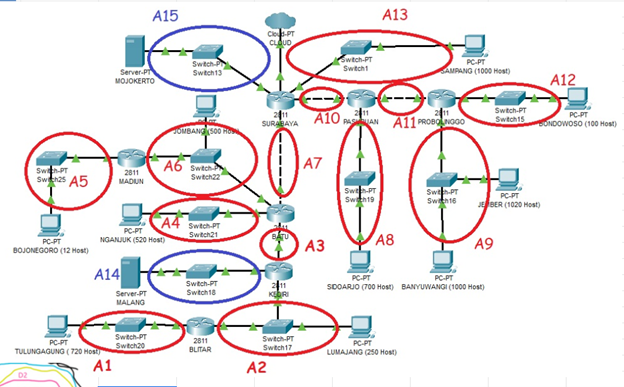
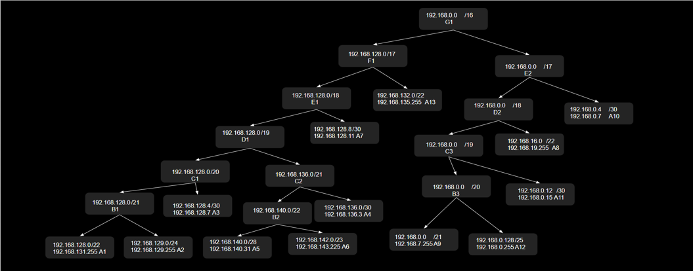

# Jarkom_Modul4_Lapres_D08
## Cisco Packet Tracer - VLSM

## UML - CIDR
Untuk UML, dipakai perhitungan routing CIDR. CIDR membagi topologi menjadi beberapa subnet, lalu secara bertahap mengelompokkan subnet-subnet tersebut menjadi 1 topologi. Pembagian IP diberikan melalui cara ini. 

Pertama, dibuat topologi di uml dengan membuat topologi di uml utama, dengan konfigurasi sbb:
```
# Switch
uml_switch -unix switch1 > /dev/null < /dev/null &
uml_switch -unix switch2 > /dev/null < /dev/null &
uml_switch -unix switch3 > /dev/null < /dev/null &
uml_switch -unix switch4 > /dev/null < /dev/null &
uml_switch -unix switch5 > /dev/null < /dev/null &
uml_switch -unix switch15 > /dev/null < /dev/null &
uml_switch -unix switch16 > /dev/null < /dev/null &
uml_switch -unix switch19 > /dev/null < /dev/null &
uml_switch -unix switch17 > /dev/null < /dev/null &
uml_switch -unix switch20 > /dev/null < /dev/null &
uml_switch -unix switch18 > /dev/null < /dev/null &
uml_switch -unix switch21 > /dev/null < /dev/null &
uml_switch -unix switch22 > /dev/null < /dev/null &
uml_switch -unix switch25 > /dev/null < /dev/null &
uml_switch -unix switch13 > /dev/null < /dev/null &

# Router
xterm -T SURABAYA -e linux ubd0=SURABAYA,jarkom umid=SURABAYA eth0=tuntap,,,10.151.78.37 eth1=daemon,,,switch1 eth2=daemon,,,switch13 eth3=daemon,,,switch2 eth4=daemon,,,switch4 mem=64M &
xterm -T PASURUAN -e linux ubd0=PASURUAN,jarkom umid=PASURUAN eth0=daemon,,,switch4 eth1=daemon,,,switch5 eth2=daemon,,,switch19 mem=64M &
xterm -T PROBOLINGGO -e linux ubd0=PROBOLINGGO,jarkom umid=PROBOLINGGO eth0=daemon,,,switch5 eth1=daemon,,,switch15 eth2=daemon,,,switch16 mem=64M &
xterm -T BATU -e linux ubd0=BATU,jarkom umid=BATU eth0=daemon,,,switch2 eth1=daemon,,,switch3 eth2=daemon,,,switch21 eth3=daemon,,,switch22 mem=64M &
xterm -T KEDIRI -e linux ubd0=KEDIRI,jarkom umid=KEDIRI eth0=daemon,,,switch3 eth1=daemon,,,switch18 eth2=daemon,,,switch17 mem=64M &
xterm -T MADIUN -e linux ubd0=MADIUN,jarkom umid=MADIUN eth0=daemon,,,switch25 eth1=daemon,,,switch22 mem=64M &
xterm -T BLITAR -e linux ubd0=BLITAR,jarkom umid=BLITAR eth0=daemon,,,switch20 eth1=daemon,,,switch17 mem=64M &

# Server
xterm -T MOJOKERTO -e linux ubd0=MOJOKERTO,jarkom umid=MOJOKERTO eth0=daemon,,,switch13 mem=64M &
xterm -T MALANG -e linux ubd0=MALANG,jarkom umid=MALANG eth0=daemon,,,switch18 mem=64M &

# Klien
xterm -T SAMPANG -e linux ubd0=SAMPANG,jarkom umid=SAMPANG eth0=daemon,,,switch1 mem=64M &
xterm -T BONDOWOSO -e linux ubd0=BONDOWOSO,jarkom umid=BONDOWOSO eth0=daemon,,,switch15 mem=64M &
xterm -T JEMBER -e linux ubd0=JEMBER,jarkom umid=JEMBER eth0=daemon,,,switch16 mem=64M &
xterm -T BANYUWANGI -e linux ubd0=BANYUWANGI,jarkom umid=BANYUWANGI eth0=daemon,,,switch16 mem=64M &
xterm -T SIDOARJO -e linux ubd0=SIDOARJO,jarkom umid=SIDOARJO eth0=daemon,,,switch19 mem=64M &
xterm -T LUMAJANG -e linux ubd0=LUMAJANG,jarkom umid=LUMAJANG eth0=daemon,,,switch17 mem=64M &
xterm -T TULUNGAGUNG -e linux ubd0=TULUNGAGUNG,jarkom umid=TULUNGAGUNG eth0=daemon,,,switch20 mem=64M &
xterm -T BOJONEGORO -e linux ubd0=BOJONEGORO,jarkom umid=BOJONEGORO eth0=daemon,,,switch25 mem=64M &
xterm -T NGANJUK -e linux ubd0=NGANJUK,jarkom umid=NGANJUK eth0=daemon,,,switch21 mem=64M &
xterm -T JOMBANG -e linux ubd0=JOMBANG,jarkom umid=JOMBANG eth0=daemon,,,switch22 mem=64M &
```

Setelah dibentuk topologi di UML, dapat dilakukan pembagian subnet
Pembagian subnet dilakukan berdasarkan diagram berikut:



1. Dari subnet-subnet tersebut, dapat dilakukan penggabungan subnet untuk pembagian IP. Penggabungan subnet dimulai dari subnet terdalam:
- A1 dan A2 digabung menjadi B1, dengan mask /21 (+1 dari A1 /22)
- A5 dan A6 digabung menjadi B2, dengan mask /22 (+1 dari A6 /23)
- A9 dan A12 digabung menjadi B3, dengan mask /20 (+1 dari A9 /21)
2. Setelah digabung menjadi subnet2 B, selanjutnya menggabungkan lagi menjadi subnet C:
- B1 dengan A3 menjadi C1, dengan mask /20
- B2 dengan A4 menjadi C2, dengan mask /21
- B3 dengan A11 menjadi C3, dengan mask /19
3. Dilanjut menjadi subnet D:
- C1 dengan C2 menjadi D1, mask /19
- C3 dengan A8 menjadi D2, mask /18
4. Dilanjut menjadi subnet E:
- D1 dengan A7 menjadi E1, mask /18
- D2 dengan A8 menjadi E2, mask /17
5. Dilanjut menjadi subnet F:
- E1 dengan A13 menjadi F1, mask /17
6. Setelah tersisa router SURABAYA semua subnet yang tersisa (F1, E2) digabung menjadi topologi G dengan netmask /16

Dari perhitungan routing CIDR, didapat tree sbb:


Untuk mencari IP, dapat digunakan IP calculator: http://jodies.de/ipcalc
Dimulai dengan IP 192.168.0.0 dengan netmask /16 dan subnet sesuai cabang2 dalam tree, didapat NetID, Netmask, dan Broadcast ID sbb:


